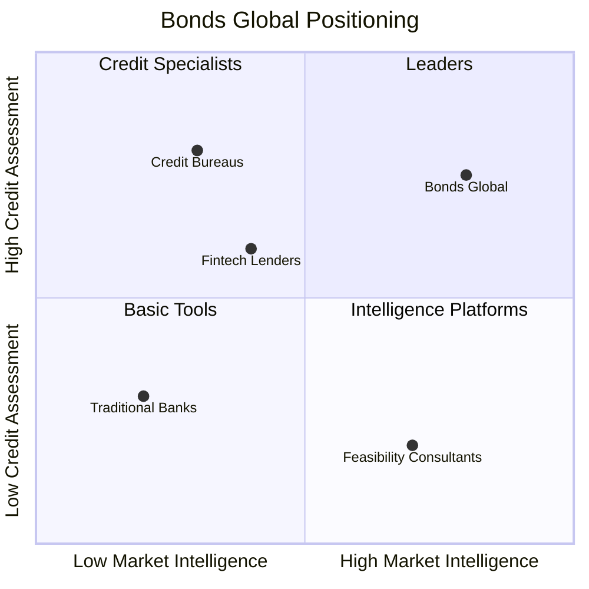

# Bonds Global — Competitive Analysis & Partnership Roadmap

> تحليل المنافسة في منطقة الشرق الأوسط وشمال أفريقيا، وخارطة طريق الشراكات لبناء مصداقية وانتشار.

---

## 1. Executive Summary

سوق التمويل الرقمي والتقييم الائتماني في المنطقة العربية ينمو بسرعة، لكنه **مجزأ**:

- شركات تمويل رقمي تركز على قطاع واحد (فواتير، مشتريات، رواتب).
- مكاتب الائتمان تركز على البيانات التاريخية.
- البنوك التقليدية لا تخدم المقترضين غير التقليديين.

**فرصة Bonds Global:** الجمع بين **دراسة الجدوى + التقييم الائتماني + الذكاء الاقتصادي** في منصة واحدة.

---

## 2. Competitive Landscape

### 2.1 Fintech Lenders

| الشركة | الدولة | النموذج | القوة | الضعف |
|---|---|---|---|---|
| **Lendo** | السعودية | تمويل الفواتير للـ SMEs | ترخيص SAMA، قاعدة بيانات | يركز فقط على الفواتير |
| **Tameed** | السعودية | تمويل سلاسل الإمداد | نمو سريع | يحتاج فواتير معتمدة |
| **Raqamyah** | السعودية | تمويل المشاريع الصغيرة | ترخيص | نطاق ضيق |
| **Sary** | السعودية | B2B marketplace + تمويل | بيانات سلوك الشراء | يخدم تجار الجملة فقط |
| **Liwwa** | الأردن/الإمارات | تمويل المشاريع | خبرة | نطاق جغرافي محدود |
| **Beehive** | الإمارات | P2P lending | نموذج مختلف | يربط المستثمرين مباشرة |
| **MNT-Halan** | مصر | Super app + lending | قاعدة ضخمة | يركز على مصر |
| **Quara** | مصر | تمويل المشاريع | سوق كبير | بيانات محدودة |

### 2.2 Credit Bureaus / Data Providers

| الجهة | الدول | البيانات | القوة | الضعف |
|---|---|---|---|---|
| **SIMAH** | السعودية | تاريخ ائتماني | معتمد من SAMA | لا يغطي الناشئات |
| **AECB** | الإمارات | تاريخ ائتماني | موثوق | يحتاج موافقات |
| **I-Score** | مصر | تاريخ ائتماني | واسع | بيانات غير متكاملة |
| **CBJ Credit Bureau** | الأردن | تاريخ ائتماني | معتمد | محدود |

### 2.3 Business Intelligence / Feasibility

| النوع | أمثلة | الفجوة |
|---|---|---|
| دراسات الجدوى التقليدية | مكاتب استشارية | بطيئة ومكلفة |
| منصات بيانات اقتصادية | CEIC، Trading Economics | لا تربط البيانات بالمشاريع |
| حاسبات بسيطة | مواقع مختلفة | غير موحدة وغير احترافية |

---

## 3. Positioning Matrix

**Differentiators:**

1. **Data-driven feasibility**: ربط المشروع ببيانات المدينة والقطاع.
2. **Credit scoring for underserved**: تقييم الناشئات وSMEs غير المشمولة.
3. **Arab-bank compatible framework**: إطار يفهمه المصرفيون العرب.
4. **Bilingual + localized**: عربي/إنجليزي مع دعم 22 دولة.

---

## 4. SWOT Analysis

### Strengths
- منصة قائمة مع 209 صفحة وحاسبات متنوعة.
- فريق يفهم السوق العربي.
- بنية V3 قابلة للتوسع.

### Weaknesses
- لا توجد بيانات تاريخية للـ calibration.
- لا يوجد ترخيص تنظيمي بعد.
- ثغرات أمنية تحتاج إصلاحًا.

### Opportunities
- السعودية: رؤية 2030 + دعم المشاريع.
- الإمارات: Regulatory Sandbox.
- مصر: سوق ضخم من SMEs.
- Supply Chain Finance مع الشركات الكبرى.

### Threats
- دخول بنوك رقمية كبيرة.
- تغيرات تنظيمية صارمة.
- منافسة محلية من fintechs مدعومة.

---

## 5. Partnership Roadmap

### Phase 1 — Data Providers (0–3 أشهر)

| الشريك | الغرض | المعيار |
|---|---|---|
| **SIMAH** | بيانات ائتمانية سعودية | اتفاقية API |
| **AECB** | بيانات ائتمانية إماراتية | اتفاقية API |
| **I-Score** | بيانات ائتمانية مصرية | اتفاقية API |
| **GASTAT / SAMA / Central Banks** | بيانات اقتصادية | مصادر مفتوحة + API |

### Phase 2 — Fintech Lenders (3–6 أشهر)

| الشريك | نموذج التعاون |
|---|---|
| **Lendo / Tameed / Raqamyah** | Bonds Global تزودهم بتقييم ائتماني أولي |
| **Sary** | تقييم موردي المنصة |
| **Beehive / Liwwa** | مشاركة methodology |

### Phase 3 — Banks (6–12 شهر)

| الشريك | نموذج التعاون |
|---|---|
| **البنوك السعودية** | أداة تقييم أولي للـ SMEs |
| **البنوك الإماراتية** | Sandbox pilot |
| **البنوك المصرية** | تقييم المشاريع الصغيرة |

### Phase 4 — Government & Ecosystem (12+ شهر)

| الشريك | نموذج التعاون |
|---|---|
| **Monsha'at / SME Bank** | دعم المشاريع الناشئة |
| **غرف التجارة** | توزيع المنصة للأعضاء |
| **الجامعات / حاضنات الأعمال** | برامج تدريب وتقييم |

---

## 6. Value Proposition per Partner

### للبنوك
> "نقلل من مخاطر الإقراض للمقترضين غير التقليديين عبر تقييم بديل يعتمد على البيانات."

### للـ Fintech Lenders
> "نوفر لكم scoring engine يقلل من وقت القرار ويزيد من دقة التحليل."

### للحكومات
> "نقيّم جدوى المشاريع قبل دعمها، ونراقب أداءها لاحقًا."

### للمقترض
> "نعطيك تقييمًا واضحًا لجدوى مشروعك وفرصتك في الحصول على تمويل."

---

## 7. Partnership Criteria

قبل الدخول في شراكة، يجب أن يتوفر:

- [ ] الترخيص التنظيمي المناسب.
- [ ] اتفاقية معالجة بيانات (DPA).
- [ ] SLA واضح.
- [ ] نموذج تجاري واضح (revenue share / SaaS fee / API fee).
- [ ] خطة Pilot محددة (3–6 أشهر).

---

## 8. First 90 Days Partnership Plan

| الأسبوع | الفعل |
|---|---|
| 1–2 | تحديد 3 شركاء محتملين |
| 3–4 | إعداد One-Pager و Pitch Deck |
| 5–8 | اجتماعات مع فintech lenders |
| 9–12 | توقيع LOI مع شريك واحد على الأقل |
| 13 | إطلاق Pilot |

---

## 9. الخلاصة

Bonds Global ليست في منافسة مباشرة مع البنوك أو fintech lenders، بل يمكن أن تكون **مورد بيانات وتقييم** لهم.

**الاستراتيجية المقترحة:**

1. البدء بشراكات **Fintech Lenders** (أسرع وأقل تنظيمًا).
2. بناء **case studies** ناججة.
3. الدخول تدريجيًا إلى **البنوك** عبر Sandbox.
4. التوسع مع **الحكومات** لدعم المشاريع.

بهذا النهج، تصبح Bonds Global جزءًا من **النظام البيئي التمويلي** في المنطقة بدلًا من أن تكون مجرد أداة مستقلة.
