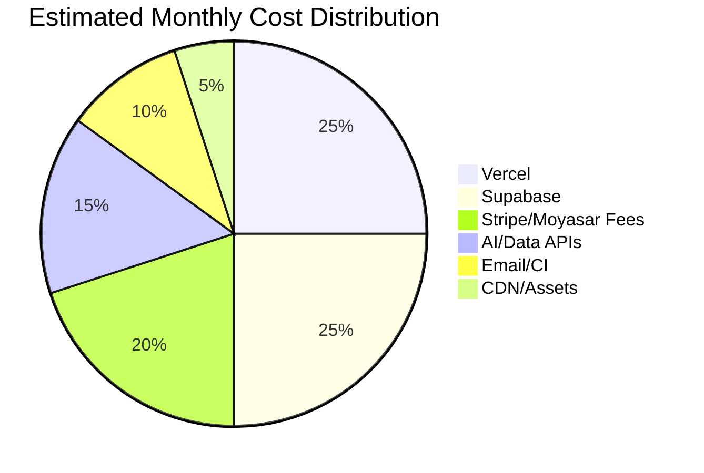

# Bonds Global — Cost Optimization Analysis

> تحليل مصاريف البنية التحتية واقتراحات لتقليل التكاليف دون التأثير على الأداء.

---

## Executive Summary

| المكون | الوضع الحالي | فرصة التوفير |
|---|---|---|
| Vercel (Hosting/Functions) | 22 handler، bandwidth عالي | 20–30% |
| Supabase (DB/Storage) | 60+ table، logs تنمو | 30–50% |
| APIs / Compute | tracking فوري، AI chat | 30–50% |
| Assets / CDN | صور كبيرة | 30–50% |
| CI/CD / Testing | visual tests ثقيلة | 20–30% |
| Dependencies | قديمة/ميتة | صغير |

**التوفير المتوقع الإجمالي: 25–40%** من التكلفة الشهرية.

**الأولوية:** تحسين الأصول + batch tracking + caching.

---

## ربط الملف بـ IMPLEMENTATION_ROADMAP.md

| المرحلة | التحسين |
|---|---|
| Phase 1 | إزالة dependencies ميتة، ضغط assets |
| Phase 2 | Rate limiting يمنع الاستخدام المفرط |
| Phase 3 | Caching للـ V3 APIs |
| Phase 4 | Archive logs، CI optimization |

---

## 1. مكونات التكلفة الرئيسية

| المكون | مزود | نوع التكلفة |
|---|---|---|
| **Hosting / Serverless** | Vercel | Ejecución, bandwidth, builds |
| **Database & Auth** | Supabase | DB size, storage, egress, edge functions |
| **Payments** | Stripe / Moyasar | Transaction fees |
| **Email** | Resend / Nodemailer | Email volume |
| **Testing** | Playwright + visual tests | CI minutes, screenshot storage |
| **Third-party APIs** | AI chat, data engines | Request volume |
| **CDN / Assets** | Vercel / CDN | Bandwidth للصور والخطوط |

---

## 2. تحليل الوضع الحالي

### 2.1 Vercel

| البند | الوضع الحالي | المخاطر |
|---|---|---|
| Serverless Functions | 22 handler (api + v3) | كل request ينشئ cold start |
| Bandwidth | 209 HTML pages + assets | كبير بسبب الصور |
| Builds | كثير من الصفحات | وقت build طويل |
| `vercel: "latest"` | غير مثبت | تكلفة غير متوقعة |

### 2.2 Supabase

| البند | الوضع الحالي | المخاطر |
|---|---|---|
| Tables | 60+ table | حجم DB ينمو |
| Storage | logos, images | egress مرتفع |
| Edge Functions | غير مستخدم كثيرًا | — |
| RLS policies | كثيرة | أداء بعض الاستعلامات |

### 2.3 APIs والحوسبة

| البند | الوضع الحالي | المخاطر |
|---|---|---|
| `/api/track` | كل page view يكتب إلى DB | تكلفة IO عالية |
| `/api/v3/ai/chat` | AI queries | مكلفة |
| `/api/v3/calculate` | حسابات معقدة | CPU time |
| Cron jobs | 3 مهام مجدولة | تكلفة دورية |

---

## 3. فرص التوفير

### 3.1 تحسين الأصول (Assets)

| الإجراء | التوفير المتوقع | الصعوبة |
|---|---|---|
| تحويل الصور إلى WebP/AVIF | 30–50% bandwidth | سهل |
| استخدام `srcset` للصور | 20–30% bandwidth | سهل |
| ضغط CSS/JS | 10–20% bandwidth | سهل |
| إزالة `styles-dark.css` المحذوف بالفعل | — | تم |
| Lazy loading للصور خارج الشاشة | 10–20% bandwidth | سهل |

### 3.2 تحسين APIs

| الإجراء | التوفير المتوقع | الصعوبة |
|---|---|---|
| دمج `/api/track` batches بدلاً من write فوري | 50–70% DB writes | متوسط |
| تفعيل `http_cache` للبيانات الثابتة | 40–60% compute | متوسط |
| تخزين نتائج `/api/v3/calculate` مؤقتًا | 30–50% compute | متوسط |
| Rate limiting لمنع الاستخدام المفرط | غير مباشر | سهل |
| تقليل عدد cron jobs أو جدولتها بذكاء | 20–30% cron cost | سهل |

### 3.3 تحسين قاعدة البيانات

| الإجراء | التوفير المتوقع | الصعوبة |
|---|---|---|
| أرشفة بيانات `page_views` القديمة | 30–50% DB size | متوسط |
| أرشفة `usage_logs` القديمة | 20–30% DB size | متوسط |
| إزالة البيانات المكررة في `profiles` | صغير | سهل |
| مراجعة indexes غير المستخدمة | أداء أفضل | سهل |

### 3.4 Dependencies

| الإجراء | التوفير المتوقع | الصعوبة |
|---|---|---|
| إزالة `@sentry/node` غير المستخدم | صغير | سهل |
| إزالة `html2canvas` و `jspdf` من `bonds-v2` | صغير | سهل |
| تثبيت `vercel` بدل `latest` | توقع أفضل | سهل |
| إضافة `puppeteer` أو حذف السكربتات | تجنب أخطاء | سهل |

### 3.5 Testing

| الإجراء | التوفير المتوقع | الصعوبة |
|---|---|---|
| تشغيل visual tests فقط على تغييرات UI | 50–70% CI minutes | متوسط |
| استخدام GitHub Actions cache | 20–30% CI time | سهل |
| حذف screenshots القديمة | تخزين أقل | سهل |

---

## 4. توصيات عالية التأثير

### قصيرة المدى (1–2 أسبوع)

- [ ] ضغط وتحويل جميع الصور إلى WebP.
- [ ] تفعيل caching للـ HTML static pages.
- [ ] دمج tracking events وإرسالها batch.
- [ ] إزالة الاعتماديات الميتة.

### متوسطة المدى (1–3 أشهر)

- [ ] بناء caching layer للـ V3 data endpoints.
- [ ] أرشفة logs القديمة.
- [ ] مراجعة وفهرسة الاستعلامات الأكثر تكلفة.
- [ ] تثبيت Vercel Pro/Enterprise للحصول على better pricing.

### طويلة المدى (3–6 أشهر)

- [ ] نقل الحوسبة الثقيلة إلى background jobs.
- [ ] تقييم الانتقال إلى Edge Functions للـ APIs البسيطة.
- [ ] استخدام CDN مستقل إذا نما traffic بشكل كبير.

---

## 5. Cost Stack Visualization

---

## 6. تقديرات التكلفة الشهرية

> هذه تقديرات تقريبية لمرحلة متوسطة النمو (10k زائر/شهر، 100 paid user).

| المكون | التكلفة الشهرية التقديرية | بعد التحسين |
|---|---|---|
| Vercel Pro | $20–50 | $20–40 |
| Supabase Pro | $25–75 | $25–50 |
| Stripe fees | 2.9% + 30¢ per transaction | ثابتة |
| Email (Resend) | $0–10 | $0–10 |
| CI/CD | $0–20 | $0–10 |
| AI / Data APIs | $20–100 | $10–50 |
| **المجموع** | **$90–305** | **$55–210** |

**التوفير المحتمل: 25–40%**

---

## 6. KPIs للمراقبة

| المقياس | الهدف |
|---|---|
| Vercel serverless execution time | < 1s average |
| Supabase DB size growth | < 10% شهريًا |
| Bandwidth per visitor | تقليل 30% |
| API response time p95 | < 500ms |
| CI build time | < 10 دقائق |

---

## 9. الخلاصة

أكبر فرص التوفير تكمن في:

1. **تحسين الأصول** (WebP, lazy loading).
2. **تقليل كتابات DB** (batch tracking, archive logs).
3. **Caching للـ V3 APIs**.
4. **تنظيف الاعتماديات**.

بهذه الإجراءات، يمكن تقليل التكلفة الشهرية بنسبة **25–40%** مع تحسين الأداء في نفس الوقت.
