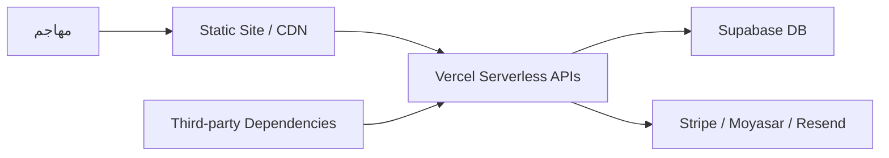

# Bonds Global — Security Audit & Data Governance

> مراجعة أمنية وحوكمة بيانات للمشروع، مع التركيز على المناطق الحساسة: APIs، Auth، RLS، الأسرار، والامتثال التنظيمي.

---

## Executive Summary

| البند | التقييم الحالي | الأولوية |
|---|---|---|
| Authentication & Authorization | 🟡 ضعيف | 🔴 عالية |
| API Input Validation | 🟡 ضعيف | 🔴 عالية |
| Rate Limiting | 🔴 حرج | 🔴 عالية |
| Database RLS | 🟡 جزئي | 🟠 متوسطة |
| Secrets Management | 🟡 جزئي | 🔴 عالية |
| Frontend Security | 🟡 أساسي | 🟠 متوسطة |
| Data Governance | 🟡 غير موثق | 🟠 متوسطة |

**التوصية الفورية:** لا يُنصح بالتعامل مع بيانات ائتمانية حساسة على نطاق واسع قبل إصلاح Rate Limiting و Auth.

---

## ربط الملف بـ IMPLEMENTATION_ROADMAP.md

| المشكلة | المرحلة | المهمة |
|---|---|---|
| Owner email مُدمج | Phase 1 | نقل إلى `ADMIN_EMAIL` env var |
| Rate limiting مفقود | Phase 2 | تطبيق limiter مركزي |
| JWT validation للفوترة | Phase 2 | التحقق من Bearer token |
| RLS مكررة | Phase 1 | تنظيف policies |
| Data Governance | Phase 4 | توثيق Retention + Deletion |

---

## 1. ملخص تنفيذي

| المنطقة | المستوى العام | الأولوية |
|---|---|---|
| Authentication & Authorization | 🟡 متوسط إلى ضعيف | 🔴 عالية |
| API Input Validation | 🟡 ضعيف | 🔴 عالية |
| Rate Limiting | 🔴 ضعيف جدًا | 🔴 عالية |
| Database RLS | 🟡 جزئي | 🟠 متوسطة |
| Secrets Management | 🟡 جزئي | 🔴 عالية |
| Frontend Security | 🟡 أساسي | 🟠 متوسطة |
| Third-Party Dependencies | 🟡 قديمة | 🟠 متوسطة |
| Data Governance | 🟡 غير موثق | 🟠 متوسطة |

---

## 2. Threat Model

### المخاطر الرئيسية

1. **API Abuse**: لا يوجد rate limiting مركزي.
2. **Auth Bypass**: بعض APIs تستخدم `userId` فقط بدون JWT.
3. **Admin Compromise**: owner email مُدمج + x-admin-token ثابت.
4. **Data Leak**: RLS غير مكتملة على بعض الجداول.
5. **Secret Exposure**: .env files قد تُرفع بالخطأ.
6. **Dependency Exploitation**: `stripe` قديم جدًا في root.

---

## 3. Audit Findings

### 3.1 Authentication & Authorization

| المشكلة | الخطورة | الموقع | الإصلاح |
|---|---|---|---|
| Owner email مُدمج (`iiffund.dev@gmail.com`) | ✅ محلول | `api/admin.js`, `admin-auth-v2.js`, `bonds-auth-2026.js` | استخدام `ADMIN_EMAIL` env var |
| `/api/create-checkout` و `/api/billing` لا يتحققان من JWT | ✅ محلول | `api/create-checkout.js`, `api/billing.js` | التحقق من Bearer token |
| `x-admin-token` وحيد لجميع admin APIs | 🟠 متوسطة | `v3/api/admin.js`, `v3/api/alerts.js`, `v3/api/data-engine.js` | RBAC + token rotation |
| `verifyAdmin` و `verifyAdminStrict` منفصلان | 🟠 متوسطة | `api/admin.js` | توحيد في middleware |
| لا يوجد session invalidation | 🟠 متوسطة | `auth-guard.js` | إضافة logout عبر Supabase |

### 3.2 APIs & Input Validation

| المشكلة | الخطورة | الموقع | الإصلاح |
|---|---|---|---|
| لا يوجد rate limiting | 🟡 قيد الإنجاز | `api/*.js` و `v3/api/*.js` | تطبيق limiter مركزي (`lib/api/rate-limit.js`) |
| Validation يدوي بسيط | 🟠 متوسطة | `api/contact.js`, `api/bank-transfer.js`, `api/pro.js` | استخدام Joi/Zod |
| CORS مفتوح (`*`) | 🟠 متوسطة | العديد من APIs | تقييد Origins |
| Stripe webhook لا يتحقق من التوقيع في كل الحالات | 🔴 عالية | `api/webhook.js` | التحقق دائمًا |
| `force-reset` / `reset-password` بدون حماية إضافية | 🟠 متوسطة | `api/password.js` | إضافة rate limit + IP allowlist |

### 3.3 Database & RLS

| المشكلة | الخطورة | الموقع | الإصلاح |
|---|---|---|---|
| RLS مكررة على `profiles` | 🟠 متوسطة | `supabase/migrations/` | تنظيف السياسات |
| `admin_roles` RLS مفعل لكن لا توجد سياسات واضحة | 🟠 متوسطة | `admin_roles` | إضافة policies صريحة |
| `usage_exceptions` RLS block public فقط | 🟠 متوسطة | `usage_exceptions` | إضافة service_role policy |
| `data_source_runs` / `raw_data` public read | 🟡 منخفضة | V3 data engine | مراجعة الحاجة للقراءة العامة |
| `ml_models` public read | 🟡 منخفضة | `ml_models` | مراجعة الحاجة |

### 3.4 Secrets Management

| المشكلة | الخطورة | الإصلاح |
|---|---|---|
| `ADMIN_TOKEN` ثابت ومشترك | 🟠 متوسطة | تدوير دوري + RBAC |
| `STRIPE_WEBHOOK_SECRET` غير مُتحقق دائمًا | 🔴 عالية | التحقق دائمًا |
| `SUPABASE_SERVICE_KEY` في `lib/api/supabase.js` فقط — يجب ألا يتسرب | 🟠 متوسطة | مراجعة access |
| `.env.local` قد يُرفع بالخطأ | 🟠 متوسطة | `.gitignore` صارم + pre-commit hook |

### 3.5 Frontend Security

| المشكلة | الخطورة | الإصلاح |
|---|---|---|
| لا يوجد Content Security Policy (CSP) | ✅ محلول | إضافة headers في `vercel.json` |
| `window.__ENV` من `api/env.js` يعرض متغيرات عامة | 🟡 منخفضة | التأكد من عدم تسريب أسرار |
| `localStorage` يستخدم لبيانات حساسة | 🟠 متوسطة | تجنب تخزين tokens/PII |
| CDN scripts بدون SRI | 🟡 منخفضة | إضافة integrity hashes |

---

## 4. Risk Matrix

| الخطر | التأثير | الاحتمالية | المخاطرة |
|---|---|---|---|
| API abuse / DDoS | عالي | عالي | 🔴 حرج |
| Auth bypass للفوترة | عالي | متوسط | 🔴 حرج |
| تسريب بيانات عملاء | عالي | منخفض | 🟠 عالي |
| Compromise حساب admin | عالي | منخفض | 🟠 عالي |
| RLS bypass | متوسط | متوسط | 🟠 متوسط |
| Dependency exploit | متوسط | منخفض | 🟠 متوسط |

---

## 5. Data Governance

### 5.1 تصنيف البيانات

| النوع | أمثلة | مستوى الحساسية |
|---|---|---|
| **PII** | اسم، بريد، هاتف، رقم هوية | عالي |
| **بيانات مالية** | دخل، قروض، أقساط | عالي |
| **بيانات ائتمانية** | تقارير SIMAH، درجات ائتمانية | عالي جدًا |
| **بيانات دفع** | بطاقات، Stripe/Moyasar payloads | عالي جدًا |
| **بيانات استخدام** | page_views، usage_logs | متوسط |
| **Master Data** | cities، sectors | عام |

### 5.2 الامتثال التنظيمي

| النظام | التطبيق | المتطلبات |
|---|---|---|
| **PDPL (السعودية)** | عملاء سعوديون | موافقة، حق الوصول/التصحيح/الحذف |
| **UAE PDPL** | عملاء إماراتيون | نفس المتطلبات |
| **GDPR** | أي مستخدم أوروبي | نفس المتطلبات + DPO إذا لزم |
| **SAMA Cyber Security Framework** | شراكات بنكية سعودية | ضوابط أمنية إضافية |
| **CBUAE** | شراكات بنكية إماراتية | امتثال Sandbox |

### 5.3 سياسات البيانات المقترحة

| السياسة | الوصف |
|---|---|
| **Retention** | الاحتفاظ ببيانات الاستخدام 12 شهرًا، بيانات الدفع 7 سنوات، PII حتى حذف الحساب + سنة |
| **Access Control** | RBAC: admin/sales/support/user |
| **Encryption** | TLS 1.2+ للنقل، AES-256 للراحة (Supabase افتراضيًا) |
| **Anonymization** | إخفاء PII في التحليلات والتقارير |
| **Deletion** | حق المستخدم في حذف حسابه وبياناته |

### 5.4 حقوق أصحاب البيانات

- **Right to Access**: المستخدم يمكنه طلب نسخة من بياناته.
- **Right to Rectification**: تصحيح البيانات الخاطئة.
- **Right to Deletion**: حذف الحساب والبيانات الشخصية.
- **Right to Object**: رفض استخدام البيانات للتسويق.
- **Right to Data Portability**: تصدير البيانات بصيغة قابلة للقراءة.

---

## 6. توصيات عملية

### 6.1 إصلاحات فورية (أسبوع 1–2)

- [x] إضافة rate limiting مركزي (`lib/api/rate-limit.js`) على APIs عامة، الحسابات، الفوترة، Admin، Webhook، و V3.
- [x] التحقق من JWT في `/api/create-checkout` و `/api/billing`.
- [x] نقل owner email إلى env var (`ADMIN_EMAIL` / `ADMIN_EMAILS`).
- [x] تفعيل CSP headers (Report-Only) في `vercel.json`.
- [x] مراجعة `.gitignore` لمنع رفع `.env*` و `package-lock.json`.

### 6.2 إصلاحات قصيرة المدى (أسبوع 3–6)

- [ ] توحيد admin auth في middleware واحد.
- [ ] تطبيق validation schemas (Joi/Zod).
- [ ] تنظيف RLS policies المكررة.
- [ ] تحديث `stripe` إلى `^22.2.x`.
- [ ] إضافة SRI لـ CDN scripts.

### 6.3 إصلاحات طويلة المدى (3–6 أشهر)

- [ ] بناء RBAC كامل للـ admin APIs.
- [ ] إضافة audit logs لكل عملية حساسة.
- [ ] تنفيذ سياسات data retention و deletion.
- [ ] إجراء penetration test خارجي.
- [ ] الحصول على شهادة أمان (SOC 2 أو ISO 27001) إذا دخلنا شراكات بنكية.

---

## 7. Action Checklist

### إصلاحات فورية (أسبوع 1–2)

- [x] إضافة rate limiting مركزي (`lib/api/rate-limit.js`) على APIs عامة، الحسابات، الفوترة، Admin، Webhook، و V3.
- [x] التحقق من JWT في `/api/create-checkout` و `/api/billing`.
- [x] نقل owner email إلى env var (`ADMIN_EMAIL` / `ADMIN_EMAILS`).
- [x] تفعيل CSP headers (Report-Only) في `vercel.json`.
- [x] مراجعة `.gitignore` لمنع رفع `.env*` و `package-lock.json`.

### إصلاحات قصيرة المدى (أسبوع 3–6)

- [ ] توحيد admin auth في middleware واحد.
- [ ] تطبيق validation schemas (Joi/Zod).
- [ ] تنظيف RLS policies المكررة.
- [ ] تحديث `stripe` إلى `^22.2.x`.
- [ ] إضافة SRI لـ CDN scripts.

### إصلاحات طويلة المدى (3–6 أشهر)

- [ ] بناء RBAC كامل للـ admin APIs.
- [ ] إضافة audit logs لكل عملية حساسة.
- [ ] تنفيذ سياسات data retention و deletion.
- [ ] إجراء penetration test خارجي.
- [ ] الحصول على شهادة أمان (SOC 2 أو ISO 27001) إذا دخلنا شراكات بنكية.

---

## 8. الخلاصة

Bonds Global يمتلك أساسًا أمنيًا مقبولًا للمرحلة الحالية، لكنه **غير جاهز لشراكات بنكية أو معالجة بيانات ائتمانية حساسة على نطاق واسع**.

**الأولوية القصوى:**

1. Rate limiting.
2. JWT validation للفوترة.
3. إزالة الأسرار المُدمجة.
4. تنظيف RLS.

بعد ذلك، يمكن البدء في بناء **Data Governance Framework** رسمي يتوافق مع PDPL و SAMA Cyber Security Framework.
