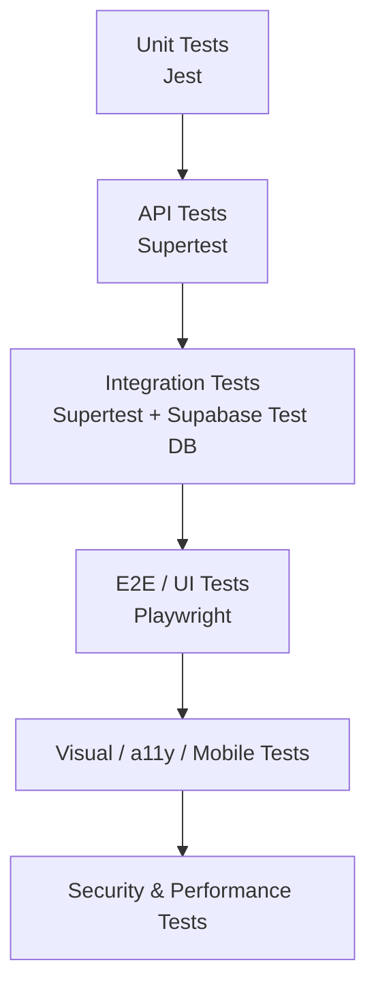

# Bonds Global — Test Strategy & CI/CD Plan

> خطة اختبارات متكاملة تغطي الواجهة، APIs، الأمان، الأداء، والوصولية، مربوطة بخارطة الطريق.

---

## Executive Summary

| النوع | الحالة | الأولوية |
|---|---|---|
| Unit Tests | ✅ موجودة | متوسطة |
| Visual Regression | ✅ موجودة | منخفضة |
| Accessibility | ✅ موجودة | متوسطة |
| Mobile Tests | ✅ موجودة | منخفضة |
| API Tests | ❌ مفقودة | 🔴 عالية |
| Integration Tests | ❌ مفقودة | 🔴 عالية |
| Security Tests | ❌ مفقودة | 🟠 متوسطة |
| Performance / Load Tests | ❌ مفقودة | 🟠 متوسطة |
| DB Migration Tests | ❌ مفقودة | 🟠 متوسطة |

**الخلاصة:** الواجهة مغطاة جيدًا، لكن APIs والتكامل يحتاجان إلى اهتمام فوري.

---

## ربط الملف بـ IMPLEMENTATION_ROADMAP.md

| المرحلة | الاختبارات المستهدفة |
|---|---|
| Phase 1 | زيادة unit tests، إضافة API tests أساسية، `npm audit` |
| Phase 2 | Integration tests للـ auth والـ billing، security tests |
| Phase 3 | V3 API tests، load tests، DB migration tests |
| Phase 4 | توسيع visual/mobile، Lighthouse CI، performance monitoring |

---

## 1. حالة الاختبارات الحالية

| النوع | الملفات | الحالة |
|---|---|---|
| **Unit Tests** | `tests/calc-functions.test.js`, `tests/bonds-geo.test.js` | ✅ موجودة |
| **Visual Regression** | `tests/visual/visual-tests.js` | ✅ موجودة (21/21) |
| **Accessibility** | `tests/a11y/a11y-tests.js` | ✅ موجودة (0 violations) |
| **Mobile Tests** | `tests/mobile/mobile-tests.js` | ✅ موجودة |
| **API Tests** | غير موجود | ❌ فجوة |
| **Integration Tests** | غير موجود | ❌ فجوة |
| **Security Tests** | غير موجود | ❌ فجوة |
| **Performance / Load Tests** | غير موجود | ❌ فجوة |
| **DB Migration Tests** | غير موجود | ❌ فجوة |

---

## 2. هرم الاختبارات المقترح



---

## 3. أنواع الاختبارات المطلوبة

### 3.1 Unit Tests

| الهدف | الأدوات | التغطية |
|---|---|---|
| دوال الحسابات | Jest | `calculators/calc-functions.js` |
| دوال الجغرافيا | Jest | `v3/master-data/countries-governorates-cities.js` |
| helpers مشتركة | Jest | `lib/`, `scripts/` |
| validation schemas | Jest | schemas جديدة |

**الهدف:** 70%+ coverage للدوال الحسابية.

### 3.2 API Tests

| الهدف | الأدوات | الأمثلة |
|---|---|---|
| CORS + methods | Supertest | جميع `api/*.js` |
| Input validation | Supertest + Jest | `/api/contact`, `/api/bank-transfer` |
| Auth checks | Supertest | `/api/admin`, `/api/billing`, `/api/v3/admin/*` |
| Webhook signature | Supertest | `/api/webhook`, `/api/v3/billing/webhook` |
| Rate limiting | k6 / autocannon | `/api/track`, `/api/v3/ai/chat` |

### 3.3 Integration Tests

| التدفق | الأدوات |
|---|---|
| signup → login → calculator → save scenario → checkout | Playwright |
| admin login → manage users → create exception | Playwright + API |
| webhook → update subscription → reflect in profile | Supertest + Supabase |
| V3 calculate → save project → generate report | API tests |

### 3.4 Visual Regression Tests

| التغطية الحالية | التوسع المقترح |
|---|---|
| 21 صفحة | جميع الصفحات الرئيسية + 3 أحجام شاشة |
| Pixelmatch | إضافة لقطات للوضع الداكن/الفاتح |

### 3.5 Accessibility Tests

| الأدوات | الهدف |
|---|---|
| axe-core | 0 violations على كل الصفحات |
| Lighthouse | score ≥ 90 |

### 3.6 Mobile Tests

| الأدوات | الهدف |
|---|---|
| Playwright device emulation | iPhone، Android |
| Lighthouse mobile | performance ≥ 60 |

### 3.7 Security Tests

| الأدوات | الهدف |
|---|---|
| npm audit | 0 critical vulnerabilities |
| OWASP ZAP / Burp Suite | SQLi، XSS، IDOR |
| Snyk | dependency scanning |

### 3.8 Performance / Load Tests

| الأدوات | الهدف |
|---|---|
| k6 / Artillery | 1000 concurrent users على `/api/v3/calculate` |
| Lighthouse | LCP < 2.5s، CLS < 0.1 |
| WebPageTest | TTFB < 600ms |

### 3.9 Database Migration Tests

| الأدوات | الهدف |
|---|---|
| Supabase CLI | تطبيق migrations على test DB |
| pgTAP | اختبار constraints و RLS |

---

## 4. CI/CD Pipeline المقترح

```yaml
name: CI

on: [push, pull_request]

jobs:
  lint:
    runs-on: ubuntu-latest
    steps:
      - uses: actions/checkout@v4
      - run: npm ci
      - run: npm run lint

  unit:
    runs-on: ubuntu-latest
    steps:
      - run: npm test

  api:
    runs-on: ubuntu-latest
    steps:
      - run: npm run test:api

  integration:
    runs-on: ubuntu-latest
    steps:
      - run: npm run test:integration

  visual:
    runs-on: ubuntu-latest
    steps:
      - run: npm run test:visual

  a11y:
    runs-on: ubuntu-latest
    steps:
      - run: npm run test:a11y

  mobile:
    runs-on: ubuntu-latest
    steps:
      - run: npm run test:mobile

  security:
    runs-on: ubuntu-latest
    steps:
      - run: npm audit --audit-level=high
      - run: npx snyk test

  performance:
    runs-on: ubuntu-latest
    steps:
      - run: npm run test:perf
```

---

## 5. بيئات الاختبار

| البيئة | الغرض |
|---|---|
| **Local** | تطوير و unit tests |
| **CI** | تشغيل جميع الاختبارات تلقائيًا |
| **Staging** | integration + visual + performance |
| **Production** | smoke tests + monitoring |

---

## 6. اقتراح سكربتات `package.json`

```json
{
  "scripts": {
    "test": "jest",
    "test:api": "jest tests/api --runInBand",
    "test:integration": "jest tests/integration --runInBand",
    "test:visual": "node tests/visual/visual-tests.js",
    "test:a11y": "node tests/a11y/a11y-tests.js",
    "test:mobile": "node tests/mobile/mobile-tests.js",
    "test:perf": "k6 run tests/perf/load-tests.js",
    "test:security": "npm audit && snyk test",
    "test:db": "supabase db test",
    "test:all": "npm run lint && npm run test && npm run test:api && npm run test:integration && npm run test:a11y"
  }
}
```

---

## 7. Roadmap Integration

| المرحلة | الاختبارات المستهدفة |
|---|---|
| **Phase 1** | زيادة unit tests، إضافة API tests أساسية، npm audit |
| **Phase 2** | إضافة integration tests للـ auth والـ billing، security tests |
| **Phase 3** | V3 API tests، load tests، DB migration tests |
| **Phase 4** | توسيع visual/mobile، Lighthouse CI، performance monitoring |

---

## 8. Success Criteria

| المقياس | الهدف |
|---|---|
| Unit test coverage | ≥ 70% |
| API test coverage | جميع endpoints الأساسية |
| a11y violations | 0 |
| npm audit critical | 0 |
| Lighthouse performance | ≥ 70 mobile، ≥ 90 desktop |
| Load test | 1000 concurrent users بدون errors > 1% |
| CI pass rate | ≥ 95% |

---

## 9. Quick Start Checklist

### الأسبوع 1–2

- [ ] إضافة `tests/api/contact.test.js` و `tests/api/bank-transfer.test.js`.
- [ ] إضافة `npm run test:api` إلى `package.json`.
- [ ] تفعيل `npm audit` في CI.

### الأسبوع 3–6

- [ ] إضافة integration test للمسار: signup → login → calculator → save scenario.
- [ ] إضافة tests لـ `/api/admin` مع admin token.
- [ ] إضافة load test بسيط لـ `/api/v3/calculate`.

### 3–6 أشهر

- [ ] تغطية 100% من APIs الأساسية.
- [ ] إضافة DB migration tests.
- [ ] Lighthouse CI في GitHub Actions.
- [ ] Penetration test دوري.

---

## 10. الخلاصة

الاختبارات الحالية جيدة للواجهة والوصولية، لكنها **ناقصة بشكل كبير في APIs والتكامل والأمان والأداء**.

**الأولوية:**

1. إضافة API tests لجميع endpoints.
2. إضافة integration tests للمسارات الحرجة (signup → payment).
3. دمج `npm audit` و Snyk في CI.
4. إضافة load tests للـ V3 APIs.

بهذه الخطة، يصبح Bonds Global قابلًا للثقة في بيئة إنتاجية حقيقية.
