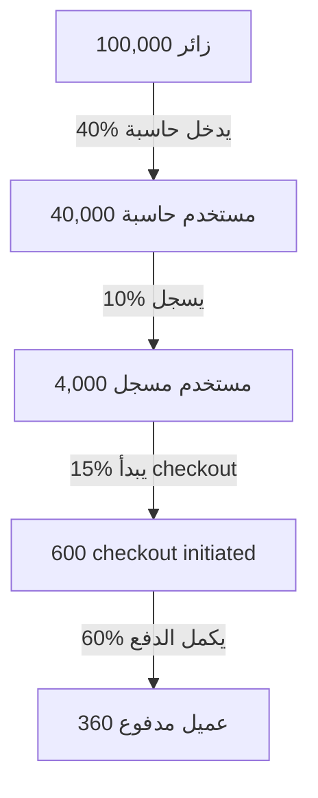

# Bonds Global — User Journey & Conversion Funnel

> رحلة المستخدم من زائر إلى عميل مدفوع ومدافع، مع نقاط التحسين وربطها بالـ CRM.

---

## Executive Summary

| المرحلة | التقييم | أهم احتكاك |
|---|---|---|
| Awareness | ✅ جيد | SEO + Blog |
| Interest | ✅ جيد | Calculators |
| Consideration | 🟡 ضعيف | صفحات تسجيل متعددة |
| Conversion | 🟡 متوسط | Bank transfer بطيء |
| Retention | 🟡 ضعيف | لا يوجد onboarding |
| Advocacy | ❌ مفقود | لا يوجد referral program |

**معدل التحويل التقديري:** 0.36% زائر → عميل مدفوع.

**الهدف:** رفعه إلى 1%+ عبر توحيد التسجيل، onboarding، وبرنامج إحالة.

---

## ربط الملف بـ IMPLEMENTATION_ROADMAP.md

| المرحلة | التحسين |
|---|---|
| Phase 1 | توحيد صفحات التسجيل |
| Phase 2 | إضافة rate limiting + validation |
| Phase 3 | إضافة onboarding flow و in-app upsell |
| Phase 4 | بناء referral/affiliate program و email engagement |

---

## 1. الشخصيات (Personas)

| الشخصية | الوصف | الهدف |
|---|---|---|
| **فهد** | رائد أعمال سعودي يريد دراسة جدوى لمشروع | تقييم جدوى المشروع والحصول على تمويل |
| **سارة** | صاحبة مطعم صغير في الإمارات | حساب تكلفة الطلبات وهوامش الربح |
| **أحمد** | مستثمر يريد تقرير احترافي | شراء تقرير Pro/Enterprise |
| **نورا** | موظفة بنك تستخدم المنصة للعملاء | الوصول إلى أدوات تقييم سريعة |

---

## 2. مراحل الرحلة

```text
Awareness → Interest → Consideration → Conversion → Retention → Advocacy
```

---

## 3. الخريطة التفصيلية

### 3.1 Awareness — الوعي

| نقطة التلامس | القناة | الحالة |
|---|---|---|
| محركات البحث (SEO) | Google / Bing | ✅ جيد |
| المقالات (Blog) | `/blog/*` | ✅ موجود |
| الإعلانات | Google Ads / Social | ⚠️ يحتاج قياس |
| التوصيات | Word of mouth | ⚠️ غير مُتتبع |

**KPIs:**

- Organic traffic.
- Impressions.
- CTR من المقالات.

---

### 3.2 Interest — الاهتمام

| نقطة التلامس | الفعل | الحالة |
|---|---|---|
| الصفحة الرئيسية | فهم الخدمة | ✅ واضحة |
| الحاسبات | تجربة أداة مجانية | ✅ متنوعة |
| صفحة التسعير | مقارنة الباقات | ✅ موجودة |
| Blog post | قراءة محتوى | ✅ موجود |

**KPIs:**

- Time on site.
- Pages per session.
- Calculator usage.

**احتكاك:**

- بعض الحاسبات لا تتطلب تسجيل، مما يزيد الاهتمام لكن يقلل Lead capture.
- لا يوجد popup أو CTA واضح لجمع البريد.

---

### 3.3 Consideration — التقييم

| نقطة التلامس | الفعل | الحالة |
|---|---|---|
| `/calculators/auth/` | إنشاء حساب | ⚠️ تسجيل معقد (عدة صفحات) |
| `/pricing.html` | مقارنة Pro/Enterprise | ✅ واضحة |
| `/pro/index.html` | تقرير Pro | ✅ موجود |
| Contact form | طلب توضيح | ✅ موجود |

**KPIs:**

- Signup rate.
- Pricing page views.
- Contact form submissions.

**احتكاك:**

- التنقل بين `/auth.html`، `/calculators/auth/`， `/auth-v2.html` محير.
- لا يوجد onboarding واضح بعد التسجيل.

---

### 3.4 Conversion — التحويل

| نقطة التلامس | الفعل | الحالة |
|---|---|---|
| Stripe Checkout | دفع Pro | ✅ موجود |
| Moyasar / Bank Transfer | دفع عبر SADAD/تحويل | ✅ موجود |
| `/pro/report.html` | عرض التقرير المدفوع | ✅ موجود |
| `/calculators/auth/subscription.html` | إدارة الاشتراك | ✅ موجود |

**KPIs:**

- Conversion rate (visitor → paid).
- Average revenue per user (ARPU).
- Checkout completion rate.

**احتكاك:**

- Bank transfer يتطلب 24 ساعة لتفعيل.
- لا يوجد upsell واضح داخل الحاسبات.

---

### 3.5 Retention — الاستبقاء

| نقطة التلامس | الفعل | الحالة |
|---|---|---|
| `/calculators/dashboard.html` | متابعة السيناريوهات | ✅ موجود |
| `/calculators/auth/profile.html` | تحديث البيانات | ✅ موجود |
| Email notifications | تذكير/تجديد | ⚠️ غير واضح |
| Saved projects | حفظ المشاريع | ✅ V3 |

**KPIs:**

- Monthly active users (MAU).
- Retention rate after 30/90 days.
- Churn rate.

**احتكاك:**

- لا يوجد engagement campaigns.
- لا يوجد notifications للتجديد قبل انتهاء الاشتراك.

---

### 3.6 Advocacy — الترويج

| نقطة التلامس | الفعل | الحالة |
|---|---|---|
| Referral program | دعوة صديق | ❌ غير موجود |
| Testimonials | تقييمات العملاء | ⚠️ محدود |
| Share report | مشاركة التقرير | ⚠️ PDF فقط |
| Affiliate | برنامج شراكة | ❌ غير موجود |

**KPIs:**

- Net Promoter Score (NPS).
- Referral rate.
- Social shares.

---

## 4. Conversion Funnel



**معدل التحويل الإجمالي: 0.36%**

**تحسينات مقترحة:

1. زيادة signup rate من 10% إلى 20% عبر إجبار التسجيل بعد السيناريو الثالث.
2. زيادة checkout initiation من 15% إلى 25% عبر upsell داخل الحاسبة.
3. زيادة completion rate من 60% إلى 75% عبر تبسيط الدفع.

---

## 5. نقاط الألم (Pain Points)

| النقطة | التأثير | الحل |
|---|---|---|
| صفحات تسجيل متعددة | تشتيت المستخدم | توحيد صفحة تسجيل واحدة |
| عدم وجود onboarding | تراجع الاستخدام | إضافة welcome flow |
| Bank transfer بطيء | فقدان عملاء | تفعيل فوري عبر Moyasar |
| لا يوجد referral | نمو بطيء | إضافة برنامج إحالة |
| لا يوجد email engagement | churn مرتفع | إضافة drip campaigns |

---

## 6. ربط CRM

| مرحلة الرحلة | جدول CRM | البيانات المسجلة |
|---|---|---|
| Awareness | `crm_leads` | مصدر الزيارة، الصفحة الأولى |
| Interest | `crm_leads` | الحاسبة المستخدمة، النتيجة |
| Consideration | `crm_prospects` | التسجيل، الباقة المهتمة |
| Conversion | `crm_clients` + `crm_contracts` | الاشتراك، القيمة |
| Retention | `crm_projects` | المشاريع المحفوظة |
| Advocacy | — | Referral ID |

---

## 7. مقترحات التحسين

### قصيرة المدى (1–4 أسابيع)

- [ ] توحيد صفحات التسجيل في `/calculators/auth/`.
- [ ] إضافة CTA واضح داخل الحاسبات للتسجيل/الترقية.
- [ ] إرسال email تأكيد بعد التسجيل.

### متوسطة المدى (1–3 أشهر)

- [ ] إضافة onboarding flow للمستخدم الجديد.
- [ ] إضافة in-app upsell للـ PDF export و 22 دولة.
- [ ] تفعيل الإشعارات قبل انتهاء الاشتراك.

### طويلة المدى (3–6 أشهر)

- [ ] بناء referral program.
- [ ] إضافة testimonials و case studies.
- [ ] إنشاء affiliate program للوسطاء والمستشارين.

---

## 8. CRO Checklist

### قصيرة المدى (1–4 أسابيع)

- [ ] توحيد صفحات التسجيل في `/calculators/auth/`.
- [ ] إضافة CTA واضح داخل الحاسبات للتسجيل/الترقية.
- [ ] إرسال email تأكيد بعد التسجيل.
- [ ] إصلاح الروابط بين `/auth.html` و `/auth-v2.html`.

### متوسطة المدى (1–3 أشهر)

- [ ] إضافة onboarding flow للمستخدم الجديد.
- [ ] إضافة in-app upsell للـ PDF export و 22 دولة.
- [ ] تفعيل الإشعارات قبل انتهاء الاشتراك.
- [ ] تسريع تفعيل bank transfer عبر Moyasar.

### طويلة المدى (3–6 أشهر)

- [ ] بناء referral program.
- [ ] إضافة testimonials و case studies.
- [ ] إنشاء affiliate program للوسطاء والمستشارين.
- [ ] بناء NPS survey دوري.

---

## 9. الخلاصة

رحلة المستخدم في Bonds Global وظيفية، لكنها **تفتقر إلى التحسين التحويلي (Conversion Optimization)**.

**الأولويات:**

1. توحيد وتبسيط التسجيل.
2. إضافة onboarding و email engagement.
3. بناء referral/affiliate program.
4. ربط كل مرحلة بـ CRM لقياس التحويل بدقة.

بهذه التحسينات، يمكن رفع معدل التحويل من 0.36% إلى 1%+ بسهولة.
