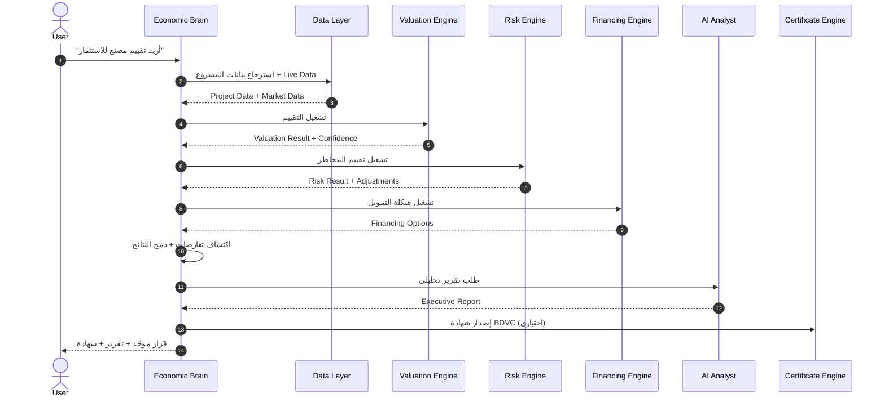

# BONDS Economic Brain — العقل الاقتصادي المركزي

> **الإصدار:** 1.0-draft  
> **المرجع الأعلى:** `docs/BONDS_CONSTITUTION.md`  
> **النوع:** وثيقة هندسية — لا يحتوي على كود

---

## 1. الهدف

BONDS Economic Brain هو **العقل المركزي للمنصة**. يتولى تنسيق جميع المحركات، وإدارة دورة اتخاذ القرار، وضمان توافق النتائج، وإصدار قرار اقتصادي موحّد للمستخدم.

> لا يقوم Brain بإجراء الحسابات بنفسه؛ بل يُشرف على المحركات ويدمج مخرجاتها.

---

## 2. النطاق

- جميع Expert Engines (Valuation, Feasibility, Risk, Cashflow, Financing, Market, Knowledge).
- جميع طبقات البيانات (Project, Asset, Scenario, Report, Certificate).
- جميع واجهات المستخدم (Client Portal, Admin, Advisor, Public Verification).
- AI Analyst, Decision Graph, Digital Twin, Confidence Engine.

---

## 3. المسؤوليات الأساسية

| المسؤولية | الوصف |
|---|---|
| **تنسيق المحركات** | يحدد أي محركات يجب تشغيلها وبالترتيب الصحيح. |
| **ترتيب أولويات التحليل** | يقرر ما إذا كان التقييم أولاً أم الجدوى أم المخاطر حسب هدف المستخدم. |
| **دورة اتخاذ القرار** | يدير حالات المشروع من Draft إلى Certified. |
| **منع تعارض النتائج** | يكتشف التناقضات بين المحركات ويُصدر تحذيرات. |
| **دمج المخرجات** | يجمع قيمة التقييم + مخاطر + تمويل + سوق في قرار واحد. |
| **قرار اقتصادي موحد** | يُنتج توصية نهائية مثل: اشتري، بيع، احتفظ، طوّر، أعِد هيكلة. |
| **توزيع البيانات** | يضمن أن أي تعديل في بيانات المشروع يصل إلى جميع المحركات. |
| **مراقبة جودة البيانات** | يتحقق من اكتمال البيانات وحداثتها ومصدرها. |
| **إعادة التشغيل التلقائي** | عند تغير بيانة، يُعيد تشغيل المحركات المتأثرة. |
| **إدارة Confidence Score** | يحسب الثقة الإجمالية للقرار. |
| **إدارة Decision Graph** | يحتفظ بعلاقات التبعية بين القيم والنتائج. |
| **إدارة Digital Twin** | يُحدّث التوأم الرقمي لكل مشروع/أصل عند تغير البيانات. |
| **إدارة AI Analyst** | يُقرر متى يُستدعي AI وما البيانات التي تُمرّر له. |

---

## 4. Architecture

```text
┌─────────────────────────────────────────────────────────────┐
│                        User Intent                          │
└──────────────────────┬──────────────────────────────────────┘
                       │
                       ▼
┌─────────────────────────────────────────────────────────────┐
│                  BONDS Economic Brain                       │
│  ┌──────────────┐ ┌──────────────┐ ┌──────────────────┐   │
│  │  Decision    │ │  Confidence  │ │   Orchestrator   │   │
│  │   Manager    │ │    Engine    │ │                  │   │
│  └──────────────┘ └──────────────┘ └──────────────────┘   │
│  ┌──────────────┐ ┌──────────────┐ ┌──────────────────┐   │
│  │   Digital    │ │  Decision    │ │  Re-computation  │   │
│  │    Twin      │ │    Graph     │ │     Scheduler    │   │
│  └──────────────┘ └──────────────┘ └──────────────────┘   │
└──────┬───────────────┬───────────────┬──────────────────────┘
       │               │               │
       ▼               ▼               ▼
┌──────────┐  ┌──────────┐  ┌──────────┐  ┌──────────┐
│ Valuation│  │Feasibility│  │  Risk    │  │ Financing│
│ Engine   │  │ Engine   │  │ Engine   │  │ Engine   │
└──────────┘  └──────────┘  └──────────┘  └──────────┘
┌──────────┐  ┌──────────┐  ┌──────────┐  ┌──────────┐
│ Cashflow │  │  Market  │  │Knowledge │  │    AI    │
│ Engine   │  │ Engine   │  │ Engine   │  │ Analyst  │
└──────────┘  └──────────┘  └──────────┘  └──────────┘
```

---

## 5. Sequence Diagram — دورة قرار كاملة



---

## 6. Data Flow

1. **Input:** المستخدم يُدخل Intent وبيانات المشروع.
2. **Validation:** Brain يتحقق من اكتمال وجودة البيانات.
3. **Routing:** Brain يحدد المحركات المطلوبة والترتيب.
4. **Execution:** تشغيل المحركات بالتوازي أو التسلسل حسب التبعيات.
5. **Reconciliation:** مقارنة النتائج واكتشاف التعارضات.
6. **Decision:** دمج النتائج في قرار اقتصادي واحد.
7. **Explanation:** توليد تفسير للقرار.
8. **Output:** تقرير، شهادة، Digital Twin update.

---

## 7. مكوّنات Economic Brain

### 7.1 Orchestrator
- يحدد ترتيب تشغيل المحركات.
- يدير التبعيات بين المحركات.
- يُعيد التشغيل عند تغير البيانات.

### 7.2 Decision Manager
- يحتفظ بحالة القرار (Draft, In Review, Approved, Certified).
- يُطبق Enterprise Workflow.

### 7.3 Conflict Resolver
- يكتشف تناقضات (مثلاً: تقييم عقاري مرتفع مع مخاطر تنظيمية حرجة).
- يُصدر تحذيرات ويُقترح إعادة المعايرة.

### 7.4 Confidence Aggregator
- يجمع درجات الثقة من جميع المحركات.
- يُنتج Confidence Score إجمالية.

### 7.5 Re-computation Scheduler
- يراقب التغييرات في البيانات.
- يُعيد تشغيل المحركات المتأثرة فقط.

---

## 8. Decision Graph

Brain يبني Decision Graph يعرض:
- أي بيانة أدت إلى أي نتيجة.
- أي نتيجة أثرت على أي قرار.
- ما يتأثر عند تغير قيمة واحدة.

---

## 9. Digital Twin

Brain يُدير Digital Twin لكل Project/Asset:
- يحتفظ بالحالة الحالية.
- يُحدّثها عند تغير السوق أو البيانات.
- يسمح بمحاكاة "What-if" دون لمس البيانات الأصلية.

---

## 10. AI Analyst Integration

Brain يُقرر:
- متى يُستدعي AI.
- ما المحركات التي يجب أن تنتهي قبل AI.
- ما البيانات التي تُمرّر للـ AI.
- كيف يُدمج تقرير AI في القرار النهائي.

> AI لا يُغيّر الأرقام. AI يكتب التحليل فقط.

---

## 11. قواعد التشغيل

- لا يُسمح لأي محرك باتخاذ قرار نهائي دون Brain.
- Brain يجب أن يكون قادراً على تفسير أي قرار.
- Brain يحترم جودة البيانات ويُوقف القرار إذا كانت الثقة منخفضة.
- Brain يُخزّن كل قرار في Decision Memory.

---

## 12. المخرجات

| المخرج | الوصف |
|---|---|
| `decision` | القرار الاقتصادي النهائي. |
| `confidence` | درجة ثقة القرار. |
| `report` | تقرير AI Decision Analyst. |
| `certificate` | شهادة BDVC (إن وُفقت الشروط). |
| `digital_twin` | حالة المشروع/الأصل المُحدّثة. |
| `warnings` | تحذيرات وتعارضات. |
| `next_steps` | خطوات مقترحة. |
